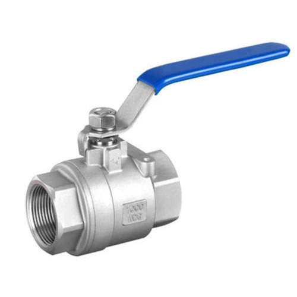

### Valve

Adds authentication and endpoint redirection to APIs that are either internal or have no auth tokens.

It may be used to interface from AWS API Gateway to internal APIs. Drop in replacement for NGINX.

Opinionated config. 

Header based authentication - x-api-token based

