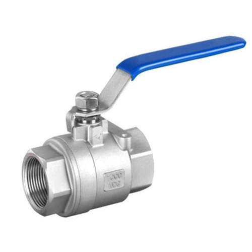
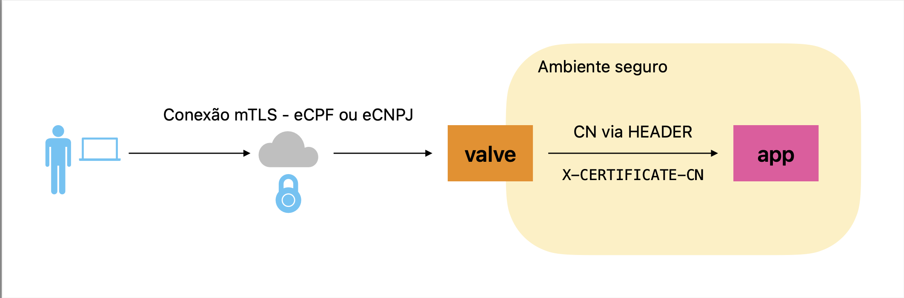

### Valve

Proxy compativel com mTLS para uso com certificados digitais compativeis com ICP Brasil (eCPF e eCNPJ)

Dados do certificado digitalOs dados extraidos de eCPF e eCNPJ, precisam da cadeia de certificado do (ICP Brasil)[https://www.gov.br/iti/pt-br/assuntos/repositorio).

O diretório icpcerts tem um script e instruções para criar e atualizar os arquivos necessários a partir da fonte original.

### Diagrama funcional

